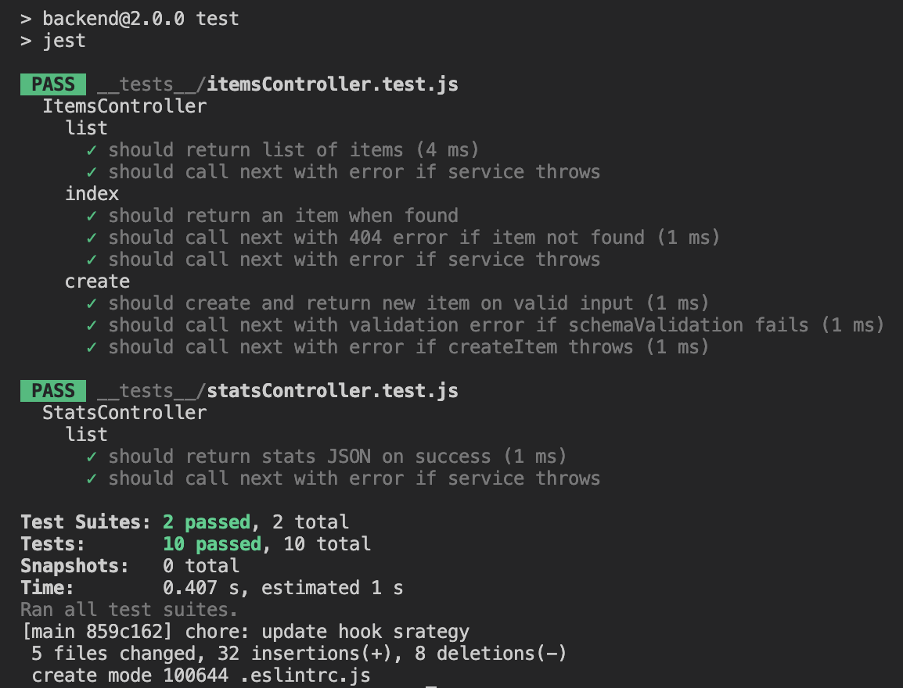

# SOLUTION.md

## 📁 Backend Structure

### ✅ Refactors & Improvements

### 1. Replaced Blocking File I/O

- Removed all `fs.readFileSync` and `fs.writeFileSync`.
- Replaced with async versions using `fs.promises`.

### 2. Added File Cache with Chokidar

- Introduced a file-level cache to avoid repeated reads.
- Used `chokidar` to watch file changes and refresh cache automatically.

### 3. Controller and Service Separation

- Moved business logic from `ItemsController` into `ItemsService`.
- Did the same for stats: `StatsController` now delegates to `StatsService`.

### 4. Input Validation with Yup

- Used `yup` to validate POST payloads.
- Enforces required fields: `name`, `category`, and `price` with correct types.

### 5. Pagination & Query Support

- Implemented `limit` and `offset` in `/api/items`.
- Query param `q` performs basic `toLowerCase().includes()` search on `name`.

### 6. Stats Optimization

- Moved stat calculation (`total`, `averagePrice`) into `StatsService`.
- Uses cached data when possible for performance.

---

## 🧪 Tests (Jest)

### Unit Tests

- ✅ `ItemsController.test.js`: list, getById, create (valid/invalid)
- ✅ `StatsController.test.js`: returns stats, handles service error

### Jest Config

- Custom config in `jest.config.js`
- Can run specific test sets with `npm run test:stats`

---

## 🔒 Git Hooks & Commit Conventions

- Added **Husky** to manage Git hooks.
- Enforced **Conventional Commits** using `@commitlint/config-conventional`.
- Integrated **lint-staged** to run Prettier on staged files.
- Hooks added:
  - `pre-commit:
    runs Prettier via lint-staged
    runs test via jest
  - `commit-msg`: checks message format with Commitlint
- All configurations are placed in the root `package.json` to support monorepo structure.

---

---

## 📄 API Docs

- Swagger set up via `swagger-jsdoc` and `swagger-ui-express`
- Swagger UI available at `/api/docs`
- Annotations added directly in `routes/index.js`

---

## 🖥️ Frontend Enhancements

- **Memory Leak Fixed**: Implemented `AbortController` in `Items.js` to cancel fetch requests on component unmount and prevent calling state updates on unmounted components.

- **Pagination & Search**: Added server-side pagination and search in `Items.js`:
  - Search input updates `q` parameter and resets page to 1.
  - "Prev"/"Next" buttons navigate through pages using `limit` and `offset` query params.

- **List Virtualization**: Integrated `react-window`'s `FixedSizeList` to render only visible rows, keeping the UI smooth for large lists.

- **Loading & Skeleton States**: Replaced plain "Loading..." text with animated skeleton rows for better UX during data fetch.

- **Accessibility Improvements**:
  - Added `aria-busy`, `aria-label`, and `aria-live` attributes on loading and content sections.
  - Provided descriptive `aria-labels` on inputs and navigation buttons.

- **Item Detail Page Tests**: Created Jest + React Testing Library tests for `ItemDetail`:
  - Loading state test with pending fetch mock.
  - Success test verifying heading, category, and price using custom matchers.
  - Error test verifying error message and back button navigation.

- **Items List Tests**: Added tests for `Items` component:
  - Loading skeleton visibility with unresolved fetch.
  - Search functionality updates results on input change.
  - Pagination test simulating multiple pages and button clicks.

- **Global Test Setup**:
  - Configured `jest-fetch-mock` for global `fetch` mocks.
  - Imported `@testing-library/jest-dom` in `setupTests.js` for extended DOM matchers.
  - Ensured `DataProvider` context is wrapped around tested components to provide `useData` values.

This completes the frontend improvements, adding robust functionality, performance optimizations, and comprehensive tests.
